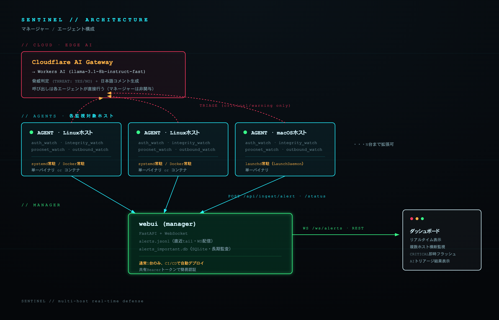
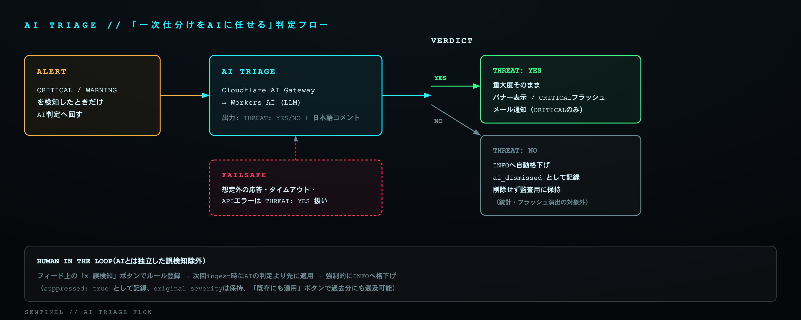
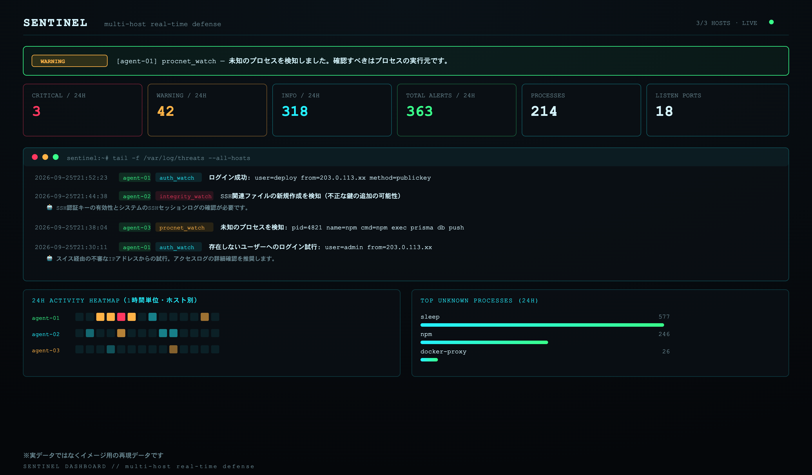

<p align="center"></p>

# SENTINEL

マルチホスト対応のホスト型IDS（侵入検知システム）。**マネージャー/エージェント構成**で、
複数のLinux/macOSホストを1つのダッシュボードから横断監視できる。
検知したCRITICAL/WARNINGアラートは**Cloudflare AI Gateway経由でAIに脅威判定させ**、
非脅威と判定されたものは自動的に静音化する（一次仕分けをAIに任せる設計）。

エージェントはDockerだけでなく、systemd(Linux)/launchd(macOS)によるネイティブ常駐にも
対応しており、GitHub Releases配布のインストーラでDockerなしに導入できる。

---

## 目次

1. [コンセプト](#コンセプト)
2. [アーキテクチャ概要](#アーキテクチャ概要)
3. [ディレクトリ構成](#ディレクトリ構成)
4. [検知内容（エージェント）](#検知内容エージェント)
5. [AIトリアージ（Cloudflare AI Gateway）](#aiトリアージcloudflare-ai-gateway)
6. [WebUI（ダッシュボード）](#webuiダッシュボード)
7. [セットアップ・新規ホスト追加](#セットアップ新規ホスト追加)
8. [エージェントのバージョニング・配布](#エージェントのバージョニング配布)
9. [CI/CD](#cicd)
10. [config.yaml リファレンス](#configyaml-リファレンス)
11. [既知の制約・ハマりどころ](#既知の制約ハマりどころ)
12. [これまでに踏んだバグと直し方（教訓）](#これまでに踏んだバグと直し方教訓)
13. [今後の拡張候補](#今後の拡張候補)

---

## コンセプト

このプロジェクトは以下の2点を軸に作っている:

1. **機能よりサイバーなデザイン**: ネオン配色、動くパーティクルネットワーク背景、
   瞬きするアイ・アイコン、スキャンライン演出、CRITICAL検知時の画面フラッシュ、
   ターミナル風フィードなど、「見ていて気分が上がるダッシュボード」であることに
   実装時間の相当量を割いている。検知ロジック自体はシンプルなルールベースに留め、
   その分UIの演出を作り込む方針で進めた（`webui/static/`配下のCSS/JSがその蓄積）。
2. **AIに一次仕分けを任せる**: Cloudflare AI Gateway（Workers AI）を使い、検知した
   異常が本当に脅威かどうかをLLMに判定させ、非脅威と判定されたものは自動的に
   目立たなくする（`ai_dismissed`）。ルールベース検知はどうしても誤検知（開発中の
   一時プロセスやDockerの内部プロセス等）が多くなるが、それを人間が逐一仕分けるのではなく
   AIに一次判定を任せ、人間は最終確認と誤検知ルールの登録に集中する運用思想。

検知ロジック自体はシンプルなルールベースであり、大規模商用IDS（Wazuh/OSSEC等）が持つ
シグネチャDBや高度な相関分析は持たない。その代わり、複数ホストを横断した見やすさ、
誤検知への対処のしやすさ、AIによる一次トリアージという運用面を作り込んでいる。

## アーキテクチャ概要



各エージェントは内部でCloudflare AI Gateway (Workers AI) を叩いてCRITICAL/WARNINGの
脅威判定・日本語コメント生成を行う（agent→Cloudflare、managerは非関与）。判定結果を
含むアラートはマネージャーへHTTP POSTされ、`alerts.jsonl`（直近tail・WebSocket配信用）と
`alerts_important.db`（SQLite、CRITICAL/WARNINGの長期監査用）の2層で永続化される。

- **エージェント**（`app/`）: 各監視対象ホストで動く。複数のルールベース検知を行い、
  検知結果をCloudflare AI Gatewayでトリアージしたうえで、マネージャーへHTTP POSTする。
  Docker常駐（`docker-compose.yml`）、ネイティブ常駐（systemd/launchd）のどちらでも
  動作する共通コードベース。ローカルには人間可読ログ（`data/alerts.log`）と、
  各Watcherの状態ファイル（オフセット・ベースライン等）だけを持つ。
- **マネージャー**（`webui/`）: 通常1台だけで動かす。全ホストからのPOSTを
  `data/alerts.jsonl`（アラート）と`data/hosts_status.json`（ホストごとの生存状況・
  CPU/MEM等）に集約し、ブラウザへREST + WebSocketで配信する。認証は共有Bearer
  トークン（`INGEST_TOKEN`環境変数）のみの簡易なもの。

## ディレクトリ構成

```
hit-linux-ids/
├── install.sh                    # Docker版インストーラー
├── install-native.sh             # ネイティブ版インストーラー（Linux/systemd）
├── install-macos.sh              # ネイティブ版インストーラー（macOS/launchd）
├── docker-compose.yml            # agent(既定)/webui(--profile server)の2サービス定義
├── Dockerfile                    # エージェント用イメージ
├── .env                          # ホスト固有の秘密値（gitignore対象、各ホストで手動作成）
├── .github/workflows/
│   ├── deploy.yml                  # マネージャーホスト専用のCI/CD（後述）
│   └── release.yml                 # エージェントのビルド・GitHub Releases公開
│
├── app/                           # エージェント本体
│   ├── main.py                      # エントリポイント。設定読み込み→監視ループ
│   ├── config.yaml                   # 検知設定（全ホスト共通、gitで配布される）
│   ├── paths.py                       # Docker/ネイティブ両対応のパス解決ヘルパー
│   ├── VERSION                         # エージェントのバージョン番号
│   ├── auth_watch.py                    # 認証ログ監視
│   ├── integrity.py                      # ファイル整合性監視（簡易AIDE）
│   ├── procnet_watch.py                   # プロセス・ネットワーク異常検知
│   ├── outbound_watch.py                   # 外向き通信の異常検知
│   ├── notify.py                            # アラート発火の中枢（AIトリアージ呼び出し→
│   │                                          マネージャー送信→ローカルログ→Webhook）
│   ├── ai_triage.py                          # Cloudflare AI Gatewayへの問い合わせ・応答パース
│   ├── central_config.py                      # ホスト固有設定(webui_url/token/host_label)の
│   │                                            解決ロジック（env var > config.yamlの順）
│   ├── status_writer.py                       # CPU/MEM/プロセス数等のスナップショット組み立て
│   └── requirements.txt
│
├── packaging/                     # ネイティブ常駐用の定義ファイル
│   ├── systemd/sentinel-agent.service
│   └── launchd/com.hit1023.sentinel-agent.plist
│
└── webui/                         # マネージャー（別イメージ）
    ├── main.py                      # FastAPI本体。/api/ingest/*, /api/alerts, /api/stats,
    │                                 # /api/hosts, /api/alerts/history, /ws/alerts
    ├── Dockerfile
    ├── requirements.txt
    └── static/
        ├── index.html                # ダッシュボードのDOM構造
        ├── style.css                  # ネオン配色・演出全般のCSS
        ├── app.js                      # フィード描画・フィルタ・WebSocket・チャート等
        └── netbg.js                    # 背景の動くパーティクルネットワーク（canvas）
```

## 検知内容（エージェント）

1. **認証ログ監視**（`app/auth_watch.py`）
   - SSHのログイン失敗を集計し、`fail_window_seconds`秒間に`fail_threshold`回を
     超えたらブルートフォースとして通知（既定: 300秒に5回）
   - 存在しないユーザーへのログイン試行を通知
   - ログイン成功も通知（`notify_on_success`でOFF可）
   - **`sensitive_users`（root/admin等）への失敗ログインは、ブルートフォース閾値に
     達していなくても1回目から即座にWARNING通知する。**
     実在するユーザー名への失敗は「invalid user」判定にならないため、通常は
     `fail_threshold`回に達するまで完全に無音になってしまう（＝存在しないユーザー名への
     攻撃はすぐ警告されるのに、より危険なroot単体への数回の失敗試行は見逃されるという
     逆転現象があった。これに気づいて追加した挙動）
   - **初回起動時は既存の`auth.log`を遡って読まず、ファイル末尾から監視を開始する**
     （でないと巨大な既存ログを一括処理して大量の過去ログイン通知が出る。実際に
     この不具合を踏んで直した経緯あり→「教訓」節参照）
   - **GeoIP + 逆引きドメイン + 見慣れない国からのログイン検知**（`geoip_enabled`）:
     発信元IPの国・都市・逆引きドメインを`app/geoip.py`（ip-api.com、APIキー不要の
     無料枠）で調べ、失敗・成功どちらのアラートメッセージにも`location=国/都市 (ドメイン)`
     として付与する。さらに、**これまで見たことのない国からのログイン成功**は
     `notify_on_success`の設定に関わらず閾値なしで即CRITICAL通知する
     （`いつもと異なるロケーションからのログイン成功`）。初回起動後に最初に観測した
     国は「いつもの場所」としてベースライン登録されるだけで通知されず、それ以降に
     新しい国が現れた場合だけがアラート対象になる。**ログイン成功時のみベースラインへ
     国を追加する**（失敗を1回混ぜるだけで攻撃者がその国を「既知」にできてしまう事故を
     防ぐため）。**見慣れない国からのログイン試行（失敗）はWARNING**として通知する
     （`_is_unusual_location_readonly()`、ベースラインへの書き込みは行わない読み取り専用判定）。
     社内LAN（プライベートIP）からのアクセスは常にスキップ（`location`が付かず、
     見慣れない国判定の対象にもならない）。結果はIPごとにキャッシュされ、
     同じIPへの繰り返し問い合わせを避ける
2. **ファイル整合性監視**（`app/integrity.py`、簡易AIDE）
   - `/etc`, `/root/.ssh`, `/etc/nginx`, `/etc/docker` 等の重要ファイルのSHA-256を記録
   - 初回はベースライン作成のみ。以降は追加/削除/改ざん（ハッシュ不一致）を検知
3. **プロセス・ネットワーク監視**（`app/procnet_watch.py`）
   - `known_process_keywords`に無い未知のプロセスが起動したら通知（部分一致判定）
   - `known_listen_ports`以外での新規LISTENを通知
   - 高CPU使用率のプロセスを通知（`cpu_alert_percent`、既定90%）
   - **CPU%計測には要注意の実装ノートあり**（後述「教訓」節）
4. **外向き通信の異常検知**（`app/outbound_watch.py`）
   - LAN内（プライベートIP）への通信は対象外。それ以外への確立済み接続のうち、
     `known_outbound_ports`（80/443/53/123/22/853）以外のポートへの通信をWARNINGで通知
   - `suspicious_ports`（Metasploit既定の4444、IRC C2の6667等）への通信は
     閾値なしで即CRITICAL
   - 一度アラートした宛先(ip, port)は以後黙る永続dedup方式（procnet_watchの
     未登録ポート検知と同じ設計）
5. **SSH公開鍵の変更検知**（`app/integrity.py`の拡張、独立watcherではない）
   - `integrity_watch.critical_patterns`（既定`*/.ssh/*`）に一致するパスは、
     通常は新規作成/削除がWARNING止まりのところ、**新規作成・削除・改ざんの
     いずれでも即CRITICAL**として扱う
   - `watch_paths`はglobパターンに対応（`/home/*/.ssh`で、rootだけでなく
     全ユーザーのSSH鍵を対象化できる）

いずれも`Notifier.alert(category, message, severity)`を呼ぶだけの単純なインターフェースで、
新しい検知器を追加する場合はこのメソッドを呼ぶWatcherクラスを1つ書いて`app/main.py`の
`watchers`リストに足せばよい。

## AIトリアージ（Cloudflare AI Gateway）



CRITICAL/WARNINGアラート発生時、`app/notify.py`の`Notifier.alert()`が
`app/ai_triage.py`の`triage()`を呼び出し、生ログをWorkers AI（Cloudflare AI Gateway
経由）に渡して以下を行わせる:

1. **脅威判定**（`THREAT: YES` / `THREAT: NO`）
2. **日本語1〜2文のトリアージコメント**（何が起きたか・緊急度・次に確認すべきこと）

プロンプト（`ai_triage.py`の`SYSTEM_PROMPT`）は、応答を必ず
```
THREAT: YES または THREAT: NO
（続けてコメント本文）
```
の2行形式に固定させ、`_parse_response()`でパースする。**想定外の形式が返ってきた場合は
安全側（`is_threat=True`、つまり通知は消さない）に倒すフェイルセーフ**になっている。

`auto_dismiss_non_threats: true`（既定）の場合、`THREAT: NO`と判定されたアラートは
`Notifier.alert()`内で重大度が`info`に格下げされ、`ai_dismissed: true` /
`original_severity: <元の重大度>` が記録に付与される。格下げされたものは:
- WebUIの統計（CRITICAL/WARNING件数）には計上されない
- CRITICALフラッシュ演出・Webhook通知の対象外になる
- **削除はされず**、フィード内には半透明+「AI SILENCED」バッジ付きで表示され続ける
  （後から見返して監査できる）
- **TOPの「AI LATEST VERDICT」バナーには出さない**（目立たせる必要がないため）

### ユーザー起点の抑制ルール（AIとは独立した誤検知除外）

AIの判定に頼らず、**人間が「これは脅威ではない」と一度教えたものは確実に黙らせたい**
というケース（開発用コマンド、既知の運用ファイルなど）向けに、AIトリアージとは別の
抑制ルール機能をWebUI側に持たせている。

- フィード上のCRITICAL/WARNINGアラートにマウスオーバーすると「✕ 誤検知」ボタンが出る
- クリックすると、カテゴリ＋メッセージに含まれる文字列（部分一致）＋対象ホスト
  （そのホストのみ／全ホスト共通を選択）でルールを登録できる
- 登録後は`/api/ingest/alert`の受信時点で**AIの判定より先に**このルールを適用し、
  一致したアラートは強制的にINFOへ格下げする（`suppressed: true`、`original_severity`は
  保持するので監査ログからは追える）
- サイドパネルの「SUPPRESSION RULES」で登録済みルールの一覧・削除ができる
- **ルール登録は将来のingestにしか効かない**（`/api/ingest/alert`受信時にその場で
  評価するだけなので、登録前に既にjsonlへ書き込み済みの過去アラートは対象外）。
  過去分にも遡って適用したい場合は「既存にも適用」ボタン
  （`POST /api/suppressions/reapply`）で、現在登録中の全ルールを`alerts.jsonl`の
  既存レコードに再評価・書き戻しできる
- 実装は`webui/main.py`の`_apply_suppressions()`。**WebUI側だけで完結する**ため、
  エージェント側の再デプロイは不要（AIトリアージ自体は引き続きagent側で実行されるので
  Cloudflareへの呼び出し自体は減らない点に注意。呼び出し自体を減らしたい場合は
  `config.yaml`の`known_process_keywords`等の恒久的なホワイトリストで対応する）

### 設定タブ

ヘッダー右上の「⚙ 設定」ボタンから開くモーダルは複数タブ構成:

#### 🔐 SSH許可リスト（ホワイトリスト）

SSH（auth_watch）専用の許可リストを管理できる。汎用的なSUPPRESSION RULESとは
別枠で、以下の2種類を登録できる:

- **IP / CIDR**（例: `203.0.113.10`、`203.0.113.0/24`） — メッセージ中の`from=IP`を
  Pythonの`ipaddress`モジュールで正しくネットワーク判定する（CIDR範囲にも対応）
- **国名**（例: `日本`） — GeoIPで解決された`location=国/都市 (ドメイン)`部分への
  文字列一致

登録した内容にマッチしたauth_watchアラートは、**「いつもと異なるロケーションからの
ログイン成功」のCRITICAL判定を含めて**強制的にINFOへ格下げされる（一般の
SUPPRESSION RULESと同じ`suppressed`フラグを使うため、SUPPRESSION RULESパネルの
「既存にも適用」ボタンでこちらも過去アラートに遡って適用できる）。
実装は`webui/main.py`の`_apply_ssh_whitelist()`、テーブルは`ssh_whitelist`
（`GET/POST /api/ssh-whitelist`、`DELETE /api/ssh-whitelist/{id}`）。

フィード上のauth_watchアラートにIPが含まれる場合は「✓ 許可リストへ」ボタンが出て、
モーダルを開かずその場でワンクリック登録できる（IPと逆引きドメインの両方が
取れている場合はどちらを登録するか選べる）。

#### 🔔 メール通知

CRITICALアラート（抑制ルール・SSH許可リストを経てなお最終的にCRITICALのままの
ものだけ）をメール通知できる。**SMTP**（Gmail等、自分のメールアカウントで直接送る）と
**Webhook**（自前のメール送信APIにJSON POSTする）の2方式に対応し、設定されている方が
使われる（両方設定した場合はSMTPが優先）。特別なメール送信基盤を持っていなくても、
SMTPだけで動くようにしてあるので、cloneしてすぐ使える。

設定項目:

- **通知を有効にする**（既定OFF）
- **宛先メールアドレス**（カンマ区切りで複数指定可）
- **送信元アドレス**（任意。省略時はSMTPユーザー名を使用）
- **SMTP**: ホスト・ポート（既定587、STARTTLS）・ユーザー名・パスワード
  - Gmailの例: `smtp.gmail.com` / `587` / Gmailアドレス /
    [アプリパスワード](https://myaccount.google.com/apppasswords)
    （2段階認証がある場合、通常のログインパスワードではSMTP認証できない）
- **Webhook**: 独自のメール送信APIがある場合のエンドポイントURL
  （`{"to": [...], "subject": "...", "text": "...", "from": "..."}` をJSON POSTする）

「テスト送信」ボタンで、実際のアラートを経由せずその場で疎通確認ができる
（`POST /api/notify-settings/test`、有効化トグルの状態に関わらず送信される）。

実装は`webui/main.py`の`_send_critical_email()`（`_send_via_smtp()`/`_send_via_webhook()`
に分岐）。`ingest_alert`が最終severityを確定した後、`severity == "critical"`のものだけ
`BackgroundTasks`で非同期送信する（メール送信の失敗・遅延がアラート取り込み自体を
ブロックしないようにするため）。設定は`app_settings`テーブル
（`GET/POST /api/notify-settings`）に保存される。SMTPパスワードは平文でDBに保存される
（このWebUI自体がLAN内の信頼された利用者向けに無認証で動く前提のため、他の設定項目と
同じ扱い）。

既定は無効（`ai_triage.enabled: false`）。account_id/gateway_id/api_tokenの
いずれかが未設定の場合も自動的にスキップされ、AIなしの従来どおりの通知になる
（`app/ai_triage.py`の`should_triage()`参照）。使いたい場合のみ以下を設定する。

### セットアップ手順

1. Cloudflareダッシュボード → AI → **AI Gateway** で新規Gatewayを作成
   （認証はOFFにしてある。理由は下記「制約」参照）
2. **My Profile → API Tokens** で「Workers AI」テンプレートのトークンを発行
   （`Account.Workers AI:Read` + `Edit`）
3. 各ホストの`.env`に以下を設定:
   ```
   CF_AI_GATEWAY_TOKEN=<発行したトークン>
   ```
4. `app/config.yaml`の`ai_triage`セクションで`enabled: true`、
   `cloudflare_account_id` / `cloudflare_gateway_id`を設定
5. `docker compose up -d --build`（またはネイティブインストーラで再起動）

### 設計上の注意点

- **モデル**: 既定で軽量・高速な`@cf/meta/llama-3.1-8b-instruct-fast`を使用。
  精度を上げたい場合は`ai_triage.model`を別のWorkers AIモデルに変更する。
- **トリアージ対象の絞り込み**: `ai_triage.trigger_severities`（既定: critical, warning）
  でINFO等の高頻度アラートは呼ばない（コスト・レイテンシ抑制）。procnet_watchの
  初回スキャン等は大量の"未知プロセス"警告を出すため、これを絞らないとAI Gateway
  へのリクエストが大量発生する点に注意。
- **失敗時の挙動**: タイムアウト（既定8秒）・APIエラー時は`triage()`が`None`を返し、
  `Notifier.alert()`は通知自体を止めない（`ai_summary`が`None`のまま記録される）。
- **User-Agent偽装が必須**: CloudflareエッジがPython標準ライブラリ`urllib`の既定
  User-Agentをボットとして`HTTP 403 (error code: 1010)`でブロックするため、
  `ai_triage.py`内でブラウザ風のUser-Agentヘッダーを明示的に付けている
  （これを消すと突然AIトリアージが全滅するので注意）。

## WebUI（ダッシュボード）



*上記はダッシュボードの構成を再現したイメージ図（実データではない）。*

サイバーパンク風の演出:

- 動くパーティクルネットワーク背景（`netbg.js`、canvas自作、外部ライブラリ不使用）
- 瞬きする目のロゴ（SVG、`eye-blink-group`を上下に潰す/戻すアニメーションで
  「まぶたを重ねて隠す」のではなく「実際に目が閉じる」ように見せている）
- 上から下へ流れる細いスキャンライン（`.scan-sweep`）
- ターミナル風のライブフィード（macOS風3色ドット、`> _`点滅カーソル、タイトルバー
  クリックで折りたたみ可能。折りたたみ中も最新1件をタイトルバーに1行プレビュー表示）
- CRITICAL検知時の画面全体フラッシュ + 該当統計カードの光るアニメーション
- 各統計値のリアルタイムスパークライン（棒グラフ、canvas自作）

機能面:

- **マルチホスト表示**: フィード各行にホストバッジ、「HOSTS」パネルに全ホストの
  オンライン/オフライン・CPU/MEM・**ホストごとのCPU/MEM推移ミニスパークライン**・
  **エージェントのバージョンバッジ**、ヘッダーに「オンライン数/全ホスト数」バッジ
- **24H ACTIVITY HEATMAP**: 直近24時間を1時間単位のマスに分け、その時間帯の最も
  重い重大度（critical > warning > info）で色を決め、件数に応じて濃淡を付けた
  GitHubのコントリビューショングラフ風の一覧。**ホストごとに行を分けて表示**する
  （全ホスト合算だと、特定の1台だけが荒れている状況が他ホストの数字に埋もれて
  しまうため）。バックエンドは`/api/stats`の`heatmap_by_host`フィールド
  （ホスト名 → 24件の`{hour_start, critical, warning, info}`配列、のマップ）。
  「TOP UNKNOWN PROCESSES」パネルと2カラムで半分の幅に並べている
- **TOP UNKNOWN PROCESSES (24H)**: procnet_watchのメッセージから`name=`パターンで
  プロセス名を抜き出し、頻出順に棒グラフ表示。`known_process_keywords`を
  チューニングする際、どのプロセスを許可リストに足すべきかの判断材料になる。
  バックエンドは`/api/stats`の`top_processes`
- **認証失敗 発信元IPランキング (24H)**: auth_watchのアラートメッセージから
  `from=<ip>`パターンを正規表現で抜き出し、ログイン成功を除いた失敗試行の
  発信元IPを多い順に表示。バックエンドは`/api/stats`の`top_auth_ips`
- **統計カードクリックでフィルタ**: CRITICAL/WARNING/INFOカードクリックでその重大度
  だけに、PROCESSES/LISTEN PORTSカードクリックで`procnet_watch`カテゴリだけに
  フィードを絞り込む。TOTAL ALERTSカードで解除。**CRITICAL/WARNINGでフィルタした
  場合はSQLiteの長期保存データ（過去ログ全件）を取得して表示する**ため、統計カード
  の件数とフィード表示件数が一致する（フィルタチップに「(過去ログ全件)」と表示）
- **AI LATEST VERDICTバナー**: 最新のAIトリアージ結果（非脅威判定を除く）をヘッダー
  直下に常時表示
- 全ての表示時刻はJST固定で生成される（サーバーのシステム時刻がUTCでも正しく
  JST表示になる。詳細は「教訓」節）
- 認証機能は**現状なし**。LAN内利用が前提。外部公開する場合は
  リバースプロキシ＋認証を挟むこと。

### バックエンドAPI（`webui/main.py`）

| エンドポイント | 用途 |
|---|---|
| `POST /api/ingest/alert` | エージェントからのアラート受信（`Authorization: Bearer <INGEST_TOKEN>`） |
| `POST /api/ingest/status` | エージェントからの状態スナップショット受信（`agent_version`を含む） |
| `GET /api/alerts?limit=&host=` | 直近アラート取得（ホスト絞り込み可） |
| `GET /api/stats` | 24時間集計・全ホストの状態・カテゴリ内訳 |
| `GET /api/hosts` | ホスト一覧とオンライン判定（`HOST_STALE_SECONDS`、既定300秒） |
| `GET /api/alerts/history?severity=&host=&category=&since_epoch=&limit=` | **長期監査用**。CRITICAL/WARNING（元severity基準、AI格下げ後も含む）だけをSQLiteから検索 |
| `WS /ws/alerts` | `alerts.jsonl`の追記をtailしてリアルタイム配信 |

### データ永続化の設計（2層構成）

- **`data/alerts.jsonl`**: 全重大度（info含む）の生ログ。追記オンリー、直近tail表示・
  WebSocket配信用。フィード表示は末尾の一定件数だけを読むため、長期間ではINFOの多さに
  埋もれて古いCRITICALが実質検索不能になる。
- **`data/alerts_important.db`（SQLite）**: **元severityがcritical/warningだったものだけ**
  を`id`をキーに永続保存（AIが非脅威判定して`info`に格下げしたものも`original_severity`で
  拾って残す）。ホスト・重大度・期間で検索できる`/api/alerts/history`から利用する。
  統計カード（CRITICAL/WARNING/24Hヒートマップ等）もこちらを正として集計する
  （jsonl側の末尾N件制限による集計漏れを避けるため）。INFOを含めなかったのは、
  頻度が高く監査価値も低いため、SQLite化の恩恵よりファイル肥大化のデメリットが
  上回ると判断したため。

## セットアップ・新規ホスト追加

### ネイティブインストール（Docker不要、推奨）

GitHub Releasesで配布している単一バイナリをsystemd(Linux)/launchd(macOS)の
常駐サービスとして直接インストールする方式。Dockerのセットアップ・特権設定
（`pid: host`等）が不要になる。

```bash
# Linux
curl -fsSL https://raw.githubusercontent.com/hit1023/sentinel/main/install-native.sh -o install-native.sh
sudo bash install-native.sh --webui-url http://<マネージャーのアドレス>:8877 --token <共有トークン> --host-label <このホストの表示名>

# macOS
curl -fsSL https://raw.githubusercontent.com/hit1023/sentinel/main/install-macos.sh -o install-macos.sh
sudo bash install-macos.sh --webui-url http://<マネージャーのアドレス>:8877 --token <共有トークン> --host-label <このホストの表示名>
```

- 対応OS/アーキテクチャ: Linux(x86_64)、macOS(Apple Silicon)。Intel Mac・Windowsは今後の課題。
- 設定ファイルは`/etc/sentinel/config.yaml`、環境変数は`/etc/sentinel/env`、
  永続化データは`/var/lib/sentinel`に配置される。
- `--version v0.2.0`のように特定バージョンを指定してインストール可能（既定は`latest`）。
- root権限が必要（procnet_watch/integrity_watchが全プロセス・全ファイルシステムを
  見る必要があるため。Docker版の`cap_add: SYS_PTRACE` + `/:/hostfs:ro`と同等の権限
  レベルであり、ネイティブ化によって権限が絞られるわけではない点に注意）。
- macOSは未署名バイナリのためGatekeeperの検疫属性を`xattr -d com.apple.quarantine`で
  インストーラが自動的に外す。コード署名・公証(notarization)は今後の課題。

### `install.sh`（Docker版）

```bash
git clone git@github.com:hit1023/sentinel.git hit-linux-ids
cd hit-linux-ids
./install.sh                  # 対話形式（エージェントのみ）
./install.sh --server          # マネージャーも同居させる場合
```

対話で聞かれる項目: マネージャーのURL、共有Ingestトークン、ホスト表示名、
（任意で）Cloudflare AI Gatewayトークン。`.env`の作成→そのホストの現在の
リスニングポート一覧の表示（`config.yaml`調整の参考用）→`docker compose up -d --build`
まで自動で行う。

非対話（自動化向け）:
```bash
./install.sh --non-interactive \
  --webui-url http://<マネージャーのアドレス>:8877 \
  --token <共有トークン> \
  --host-label <このホストの表示名>
```

### 手動セットアップ

`install.sh`を使わない場合、`.env`を手動で用意して`docker compose up -d --build`
（マネージャーホストなら`--profile server`を追加）するだけでよい。`.env`の内容は
[config.yamlリファレンス](#configyaml-リファレンス)を参照。

### 新規ホストのチェックリスト

1. リポジトリをclone（読み取り専用deploy key推奨）
2. `.env`を作成（`install.sh`推奨）
3. `app/config.yaml`の`procnet_watch.known_listen_ports` / `known_process_keywords`を
   そのホストの実構成に合わせて調整（`ss -tlnp` / `docker ps`で確認）
4. **重要**: このホストがCI/CD対象外（マネージャー以外）の場合、`config.yaml`を
   ホスト固有に編集したら`git update-index --skip-worktree app/config.yaml`しておくこと。
   でないと次回`git pull`時にマージ処理が走り、意図せず衝突・上書きの可能性がある
   （マネージャーは`git reset --hard`で強制上書きするCI方式なので、そもそも
   ホスト固有の値は`config.yaml`に書かず`.env`に書く設計にしてある。詳細は
   `app/config.yaml`冒頭のコメントおよび下記「既知の制約」参照）
5. `docker compose up -d --build`（またはネイティブインストーラ実行）
6. マネージャーの「HOSTS」パネルに新しいホストが緑ドットで現れれば成功

## エージェントのバージョニング・配布

エージェントは`app/VERSION`でバージョン管理されており、タグをpushすると
GitHub Actions（`.github/workflows/release.yml`）がLinux(x86_64)/macOS(Apple Silicon)向けの
単一バイナリを自動ビルドし、GitHub Releasesに公開する。

新しいバージョンをリリースする手順:
```bash
# app/VERSION を新しいバージョン番号に書き換えてコミットした後
git tag v0.2.0
git push origin v0.2.0
```

ビルド成果物には、バイナリ本体・`config.yaml`のサンプル・systemd unit/launchd plist・
インストーラスクリプトが同梱される。`install-native.sh` / `install-macos.sh`は
GitHub Releasesから最新（または指定バージョン）のアセットを取得して展開する。

### 自動更新（`updater`）

各エージェントは`config.yaml`の`updater.enabled: true`で、GitHub Releasesの最新版を
定期チェックできる（既定は無効、`app/updater.py`）。

- `updater.check_interval_seconds`（既定6時間）ごとにGitHub Releases APIを叩き、
  自分のバージョンと比較する。
- 新しいバージョンがあれば`updater`カテゴリでINFO通知（司令塔のフィードに出るだけ）。
- `updater.auto_apply: true`にすると、新しいバイナリをダウンロードして
  `.sha256`アセットとSHA256を照合し、一致すれば`/opt/sentinel/sentinel-agent`を
  差し替えたうえでプロセスを終了する。systemd(`Restart=always`)/launchd(`KeepAlive`)が
  自動的に新バイナリで再起動する（プロセス内での自己exec置換のような複雑なことはしない）。
- IDSが更新失敗で無言停止するリスクを避けるため、`auto_apply`の既定はfalse
  （通知のみ）。運用者が動作を確認したうえで明示的にoptインすることを推奨する。

## CI/CD

**マネージャーホストのみ**自動デプロイ対象。`main`ブランチへのpushで、マネージャー上の
自己ホストGitHub Actionsランナーが以下を実行する（`.github/workflows/deploy.yml`）:

```
git fetch origin main && git reset --hard origin/main
docker compose --profile server up -d --build
curl -sf http://localhost:8877/api/stats  # ヘルスチェック
```

エージェント専用ホストは対象外。コード更新は手動で
`git pull && docker compose up -d --build`（`config.yaml`をskip-worktreeにしている
場合は`git pull`が安全）、またはネイティブ運用ならインストーラの再実行/自動更新機能を使う。

## config.yaml リファレンス

`app/config.yaml`はgit管理下で全ホスト共通デプロイされる。**ホストごとに異なるべき
値（`central.*`のURL/トークン/ホスト名、Cloudflareトークン）は`.env`（gitignore対象）
で上書きする設計**（`app/central_config.py`が環境変数優先で解決する）。

| キー | 既定値 | 説明 |
|---|---|---|
| `interval_seconds` | 60 | 監視ループの間隔（秒） |
| `central.enabled` | true | マネージャーへの送信を有効化するか |
| `central.webui_url` | "" | **.envの`CENTRAL_WEBUI_URL`推奨**。マネージャーのURL |
| `central.ingest_token` | "" | **.envの`CENTRAL_INGEST_TOKEN`推奨** |
| `central.host_label` | "" | **.envの`CENTRAL_HOST_LABEL`推奨**。空ならOSホスト名 |
| `auth_watch.fail_threshold` | 5 | ブルートフォース判定の失敗回数閾値 |
| `auth_watch.fail_window_seconds` | 300 | 上記の時間窓 |
| `auth_watch.notify_on_success` | true | ログイン成功も通知するか |
| `auth_watch.use_journalctl` | false | trueならjournalctl方式（journalマウントも要有効化） |
| `auth_watch.sensitive_users` | root, admin, administrator, ubuntu | これらのユーザーへの失敗ログインは閾値未満でも即WARNING |
| `auth_watch.geoip_enabled` | true | GeoIP+逆引き+見慣れない国からのログイン検知を有効化 |
| `integrity_watch.watch_paths` | `/etc`, `/root/.ssh`等 | 整合性監視対象（globパターン可） |
| `integrity_watch.critical_patterns` | `*/.ssh/*` | 一致パスは新規/削除/改ざんいずれも即CRITICAL |
| `procnet_watch.known_listen_ports` | （ホストごとに要調整） | 既知ポート一覧 |
| `procnet_watch.known_process_keywords` | （ホストごとに要調整） | 既知プロセス名（部分一致） |
| `procnet_watch.cpu_alert_percent` | 90 | 高CPU通知の閾値(%) |
| `outbound_watch.known_outbound_ports` | 80, 443, 53, 123, 22, 853 | LAN外へのこのポート宛通信は正常扱い |
| `outbound_watch.suspicious_ports` | 4444, 1337, 6666, 6667, 31337, 12345, 54321 | 一致したら閾値なしで即CRITICAL |
| `outbound_watch.local_service_ports` | （main.pyがprocnet_watch.known_listen_portsから自動継承、手動設定不要） | このホストが公開しているサービスのポート。着信をここへの「外向き通信」と誤判定しないための除外リスト |
| `notify.webhook_url` / `webhook_token` | "" | 既存の通知APIへの転送用（任意） |
| `ai_triage.enabled` | true | AIトリアージを使うか |
| `ai_triage.trigger_severities` | critical, warning | トリアージ対象の重大度 |
| `ai_triage.cloudflare_account_id` / `cloudflare_gateway_id` | 各自の値を設定 | Cloudflareダッシュボードで確認 |
| `ai_triage.model` | `@cf/meta/llama-3.1-8b-instruct-fast` | Workers AIモデル名 |
| `ai_triage.api_token` | "" | **.envの`CF_AI_GATEWAY_TOKEN`推奨** |
| `ai_triage.timeout_seconds` | 8 | Gateway呼び出しのタイムアウト |
| `ai_triage.auto_dismiss_non_threats` | true | 非脅威判定を自動でINFOへ格下げするか |
| `updater.enabled` | false | 新バージョンの検知を有効化するか |
| `updater.check_interval_seconds` | 21600 | チェック間隔（秒、既定6時間） |
| `updater.auto_apply` | false | 新バージョンを自動適用するか（既定は通知のみ） |
| `updater.github_repo` | `hit1023/sentinel` | チェック先のGitHubリポジトリ |

## 既知の制約・ハマりどころ

- **GeoIP「見慣れない国」判定は最初の1〜2回が甘い**: 初回起動後に最初に観測した国だけが
  無条件でベースライン登録される。普段から複数の国（例: 自宅と出張先）から正規にログイン
  している場合、2つ目の国が現れた時点でまだ「見慣れない国」としてCRITICAL誤検知が出る
  （3つ目以降からは正しく既知として扱われる）。運用上は初回デプロイ直後に想定される
  全ロケーションから一度ずつログインしてベースラインを育てておくか、誤検知が出たら
  Suppression機能（`category: auth_watch`、パターンに国名を含める）で黙らせるとよい。
- **ip-api.comの無料枠はHTTPのみ・レート制限あり**（45リクエスト/分）。`geoip.py`が
  IPごとに結果を永続キャッシュすることで通常運用では問題にならないが、短時間に大量の
  新規IPからアクセスが来る状況（DDoS等）ではレート制限に達し、それ以降の問い合わせは
  黙って失敗する（`location`が付かないだけで検知自体は継続する）。
- **Docker Desktop（macOS）での`network_mode: host`**: 実際のmacOSホストではなく、
  Docker Desktopが内部で使うLinux VMを見ることになる。この制約はネイティブ常駐化
  （systemd/launchd）で完全に解消される。
- **WebUIに認証機能なし**: LAN内利用が前提。外部公開するならリバースプロキシで
  認証を挟むこと。
- **AI Gatewayの認証はOFF**: Gateway作成時に「認証済みゲートウェイ」をOFFにしている
  （ONのままだと`cf-aig-authorization`ヘッダーが別途必要になり実装が複雑化するため）。
  Workers AI呼び出し自体は`CF_AI_GATEWAY_TOKEN`（Cloudflare APIトークン）で保護されて
  いるので、Gateway側の追加認証がなくても第三者が勝手に推論を実行することはできない
  （はず。要再確認）。
- **AIトリアージのコスト**: procnet_watchの初回スキャンや大量の未知プロセス検知時、
  トリアージ対象（critical/warning）が多いとWorkers AIへのリクエストが急増する。
  現状レート制限やコスト上限の仕組みは未実装。
- **fail2ban等のOS標準対策は別途導入を推奨**: SENTINELは検知に特化しており、
  自動遮断は行わない（誤検知でホスト自身のSSHが締め出されるリスクを避けるため）。
  実運用ではSSH公開ホストにfail2ban等のブルートフォース対策を別途入れることを推奨する。

## これまでに踏んだバグと直し方（教訓）

実装中に実際に発生し、修正したバグ。同種の問題を作り込まないための参考に:

1. **auth_watch初回起動時のログ全読み込み** — 数十MB規模の既存`auth.log`を最初から
   読んでしまい、過去の全ログイン成功（数万件規模）を通知してしまった。
   → 初回はファイル末尾から監視開始するよう修正（`_iter_new_lines_from_file`）。
2. **procnet_watchのCPU%が数千%になる誤検知** — `psutil.process_iter()`の
   attrsに`"cpu_percent"`を含めると、その場での内部計測と直後の
   `p.cpu_percent(interval=None)`呼び出しがほぼ無時間差の二重計測になり、
   OSのクロック粒度の丸め誤差で荒唐無稽な値が出た。
   → attrsから`cpu_percent`を除去し1回だけ計測。念のためCPUコア数×100%を
   超える値は無視するガードも追加。
   （副次的な発見: AIがこの壊れた数字を要約する際、桁を見誤ることも確認。
   生データが壊れているとAIの要約も信頼できない、という実例）
3. **Cloudflare AI GatewayがHTTP 403 (error code: 1010)で全滅** — Python
   `urllib`の既定User-Agentがボットとしてブロックされていた。
   → ブラウザ風User-Agentを明示的に設定（`ai_triage.py`）。
4. **Docker Desktop(macOS)の`network_mode: host`が実ホストを共有しない** —
   ローカルテスト時、コンテナ内`localhost`から同ホストのマネージャーに到達できず
   `Connection refused`。実Linuxホストでは問題なし。ネイティブ常駐化で解消。
5. **`.env`の反映漏れ** — 環境変数追加直後にCIが`docker compose up`済みだったため、
   コンテナが古い`.env`のまま起動していた。
   → `.env`変更後は`docker compose up -d --force-recreate`が必要な場合がある
   （docker composeは`.env`を`up`実行時にしか読まない）。
6. **outbound_watchが着信を外向き通信と誤検知** — `psutil.net_connections()`の
   `ESTABLISHED`接続は通信の向きを区別せず、自ホストが公開しているWebサービスへの
   外部からの正常なアクセスも`raddr`に相手のランダムな送信元ポートが入るだけで
   拾ってしまい、「未登録ポートへの外向き通信」として誤検知していた（同一IPから
   毎回異なるポート番号で複数回検知、という挙動が手がかりになった）。
   → ローカル側ポート(`c.laddr.port`)が自ホストの公開サービスのポート
   （`procnet_watch.known_listen_ports`を継承）、または1024未満のwell-knownな
   ポートであれば「着信」とみなしてスキップするよう修正（`local_service_ports`）。
7. **CRITICAL/WARNING統計がjsonlの末尾N件制限で取りこぼされる** — 統計・ヒートマップの
   集計がjsonlの末尾数千行だけを読む実装だったため、procnet_watch等の大量の
   WARNING/INFOでウィンドウが埋まると、実際には発生している古いCRITICALが集計から
   漏れ、ダッシュボード上は「CRITICAL 0件」に見えてしまうことがあった。
   → CRITICAL/WARNINGは既にSQLiteに全件永続化されているため、統計・ヒートマップ・
   フィルタ結果はすべてSQLite側を正として集計・取得するよう統一した。
8. **SQLite保存漏れ（AIが脅威と判定した最重要アラートほど保存されない逆転バグ）** —
   エージェント側は「AIが非脅威と判定して格下げした場合だけ元の重大度を送る」設計で、
   格下げしなかった場合は`original_severity`を明示的に`None`として送っていた。
   マネージャー側の受信処理が`dict.get(key, default)`でこれを受けていたが、
   Pythonの`dict.get`は**キーが値`None`で存在する場合はdefaultを使わない**仕様のため、
   `original_severity`が`None`のまま扱われ、SQLite保存条件に一致せず弾かれていた。
   結果、AIが「非脅威」と判定したどうでもいいアラートだけが保存され、AIが本当に
   脅威と判定した重要なアラートほど保存されない、という完全に逆転した状態になっていた。
   → 受信側を`record.get(key) or default`という明示的なfalsyチェックに変更。
   同種のパターンが抑制ルール・ホワイトリスト適用処理にも存在しており、あわせて修正。
   **教訓**: `.get(key, default)`は「キーが無い」場合のフォールバックであり、
   「値がNoneかもしれない」場合のフォールバックには使えない。
9. **サーバー時刻がUTCのため表示時刻が9時間ずれる** — ホストのシステム時刻が
   UTCで動いている環境では、タイムスタンプ生成にシステムのローカルタイムを使う
   実装だと、実際の時刻より9時間遅れて表示されてしまう。
   → コンテナのTZ環境変数に頼らず、Python側でJST固定のtimezoneオブジェクトを
   明示的に使う方式に変更。複数ホスト・複数実行環境をまたぐ場合は、OS側のタイムゾーン
   設定に依存せずアプリケーション側で明示指定する方が確実。

## 今後の拡張候補

- Windows向けエージェントの実装（現状はLinux/macOSのみ対応）。
- WebUIからのインストーラダウンロードページ（過去バージョンも選択可能）。
- エージェントの自動更新機能（新バージョン検知の通知は実装済み、自動適用は今後）。
- Dockerコンテナ自体の異常（想定外イメージの起動等）を`docker.sock`経由で
  監視する拡張。
- AIトリアージのレート制限・コスト上限（Workers AI呼び出し回数が青天井）。
- WebUIへの認証機能追加（現状LAN内・信頼境界内での利用が前提）。
- ホストがオフラインになったこと自体をアラートとして扱う（現状は「HOSTS」パネルの
  表示が変わるだけで、通知としては発火しない）。
