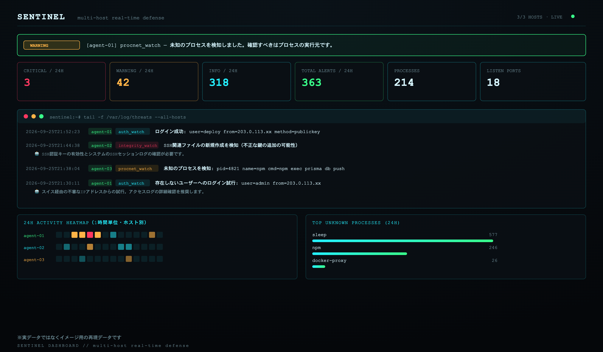
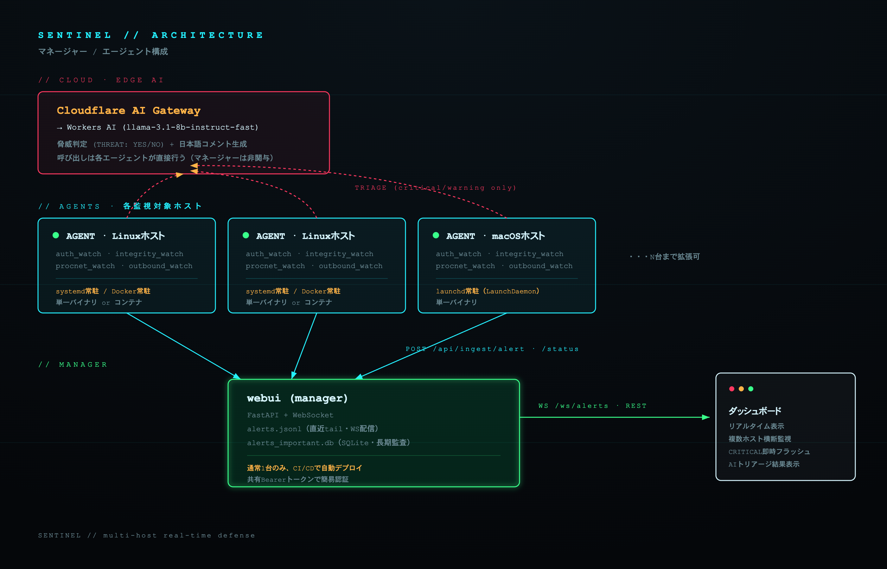

<p align="center"></p>

# SENTINEL

マルチホスト対応のホスト型IDS（侵入検知システム）。**マネージャー/エージェント構成**で、
複数のLinux/macOSホストを1つのダッシュボードから横断監視できる。
検知したCRITICAL/WARNINGアラートは**Cloudflare AI Gateway経由でAIに脅威判定させ**、
非脅威と判定されたものは自動的に静音化する（一次仕分けをAIに任せる設計）。
通知は**メール（SMTP/Webhook）とSlack**に対応し、設定はWebUIから行える。
ダッシュボードの**ATTACK MAP（世界地図のHUD）**は、攻撃の流れと脅威レベルを一目で示す。

エージェントはDockerだけでなく、systemd(Linux)/launchd(macOS)によるネイティブ常駐にも
対応しており、GitHub Releases配布のインストーラでDockerなしに導入できる。



*ダッシュボードの構成を再現したイメージ図（実データではない）。*

---

## 目次

- [コンセプト](#コンセプト)
- [アーキテクチャ概要](#アーキテクチャ概要)
- [何を検知できるか](#何を検知できるか)
- [ATTACK MAP（世界地図のHUD）](#attack-map世界地図のhud)
- [「侵入された」を判断できるか](#侵入されたを判断できるか)
- [SENTINELが守る範囲と、別途点検すること](#sentinelが守る範囲と別途点検すること)
- [通知](#通知)
- [クイックスタート](#クイックスタート)
- [ドキュメント](#ドキュメント)
- [ディレクトリ構成](#ディレクトリ構成)
- [テスト](#テスト)
- [今後の拡張候補](#今後の拡張候補)

---

## コンセプト

1. **機能よりサイバーなデザイン**: ネオン配色、動くパーティクルネットワーク背景、
   瞬きするアイ・アイコン、スキャンライン演出、CRITICAL検知時の画面フラッシュ、
   ターミナル風フィードなど、「見ていて気分が上がるダッシュボード」であることに
   実装時間の相当量を割いている。検知ロジック自体はシンプルなルールベースに留め、
   その分UIの演出を作り込む方針（`webui/static/`配下のCSS/JSがその蓄積）。
2. **AIに一次仕分けを任せる**: 検知した異常が本当に脅威かどうかをLLMに判定させ、
   非脅威と判定されたものは自動的に目立たなくする（`ai_dismissed`）。ルールベース検知は
   どうしても誤検知（開発中の一時プロセスやDockerの内部プロセス等）が多くなるが、それを
   人間が逐一仕分けるのではなくAIに一次判定を任せ、人間は最終確認と誤検知ルールの登録に
   集中する運用思想。

大規模商用IDS（Wazuh/OSSEC等）が持つシグネチャDBや高度な相関分析は持たない。その代わり、
複数ホストを横断した見やすさ、誤検知への対処のしやすさ、AIによる一次トリアージという
運用面を作り込んでいる。

## アーキテクチャ概要



- **エージェント**（`app/`）: 各監視対象ホストで動く。複数のルールベース検知を行い、
  検知結果をCloudflare AI Gatewayでトリアージしたうえで、マネージャーへHTTP POSTする。
  Docker常駐、ネイティブ常駐（systemd/launchd）のどちらでも動く共通コードベース。
  ローカルには人間可読ログ（`data/alerts.log`）と各Watcherの状態ファイルだけを持つ。
- **マネージャー**（`webui/`）: 通常1台だけで動かす。全ホストからのPOSTを
  `alerts.jsonl`（直近tail・WebSocket配信用）、`alerts_important.db`（SQLite、
  CRITICAL/WARNINGの長期監査用）、`hosts_status.json`（ホストごとの生存状況・CPU/MEM等）に
  集約し、ブラウザへREST + WebSocketで配信する。メール/Slack通知とエージェント死活監視も
  マネージャーが担う。認証は共有Bearerトークン（`INGEST_TOKEN`）のみの簡易なもの。

## 何を検知できるか

| 検知 | 見ているもの | 例 |
|---|---|---|
| 認証ログ（`auth_watch`） | SSHのログイン失敗・成功 | ブルートフォース、root等への試行、見慣れない国からのログイン、**侵入成功の相関検知** |
| ファイル整合性（`integrity_watch`） | 重要ファイルのSHA-256 | `/etc`の改ざん、`authorized_keys`の変更（即CRITICAL） |
| プロセス/ネットワーク（`procnet_watch`） | 未知プロセス・未登録LISTENポート・高CPU | バックドアのポート開放、マイナー |
| 外向き通信（`outbound_watch`） | LAN外への確立済み接続 | C2通信・情報持ち出し（攻撃ツール既定ポートは即CRITICAL）。地図の **OUT** にも描画 |
| Webアクセスログ（`web_watch`） | Nginx/NPMのアクセスログ（ホストごとに有効化） | 管理パス探索、認証失敗の連発、パストラバーサル、**攻撃ペイロード、既知スキャナ、Webシェル探索、機密パスへの成功応答(CRITICAL)** |
| 脆弱性照合（`package_watch` + マネージャー） | インストール済みdpkgパッケージ × OSV.dev / CISA KEV | 悪用確認済み(KEV)脆弱性の検知と対応ガイド |
| **エージェント死活監視**（マネージャー側） | エージェントからの状態送信 | エージェントの停止・ネットワーク断・ホストのダウン |

各検知の閾値・仕様・実装メモは [docs/detection.md](docs/detection.md) を参照。

## ATTACK MAP（世界地図のHUD）

ダッシュボードの地図は、**目で即座に状況を確認するためのHUD**。外部からの攻撃を、攻撃元から自宅へ向かう光の弧で描く。

- **脅威レベル**（右上）: `SECURE`（緑）/ `CAUTION`（橙）/ `ALERT`（赤）。赤は「直近6時間に防げなかった攻撃」または「直近1時間のCRITICAL（脆弱性照合・死活監視を除く）」。
  シールドと自宅の色もレベルに連動し、`ALERT` ではパネルが赤く脈打つ。SSH・WEB・外向き通信の件数、BREACH、ホストのオンライン数、KEV脆弱性数も並ぶ。
- **種類**: SSH攻撃（赤）／Web攻撃（橙）／不審ログイン成功（紫）／**Web攻撃の成功応答**（赤橙）／**外向き通信**（マゼンタ、自宅から宛先へ向かう）。
- **ガード演出**: 防げた攻撃（ログイン失敗・Webスキャン）はシールドで止まって弾かれる。防げなかった攻撃（不審ログイン成功・Web成功応答）はシールドを貫通して着弾する。
- **ALL / SSH / WEB / OUT** を切り替えて、種類ごとに見られる。

詳細は [docs/webui.md](docs/webui.md) を参照。

## 「侵入された」を判断できるか

**侵入を断定する機能はない。ただし、侵入の兆候は複数の経路で拾える。** 最終的な判断（侵入されたか否か）は
人間が、SSH成功履歴・`authorized_keys`・不審なcron/常駐・外向き接続を調べて確定させる前提。

拾える兆候:

- **認証突破**: 失敗の連発後に同じIPからログインが成功（`侵入成功の疑い`、即CRITICAL、AIで格下げされない）／
  見慣れない国からのログイン成功（即CRITICAL）
- **足場づくり**: SSH公開鍵の追加・削除・改ざん（即CRITICAL）、重要ファイルの改ざん、未知プロセスや新規LISTENポート
- **Webからの攻撃**: 機密パスやWebシェルへのアクセスに成功応答が返ったとき（即CRITICAL）、攻撃ペイロード・既知スキャナ・スクリプト探索（WARNING）
- **外部との通信**: 攻撃ツール既定ポートへの外向き通信（即CRITICAL）、未登録ポートへの通信
- **検知の妨害**: エージェントの停止（死活監視が途絶を検知）

弱い点（詳細は [既知の制約](docs/known-issues-and-lessons.md)）:

- 失敗を経ない認証突破（漏えいしたパスワード・盗まれた鍵でいきなり成功）や、同じ国のVPS経由のログインは、通常のINFOに見える
- `sudo`/`su`による権限昇格、新規ユーザー作成、`.bash_history`の改変などは見ていない
- 正規プロセス名への偽装やメモリ上だけで動くマルウェアは見えない
- ホスト側の記録（`alerts.log`）は、root権限を奪われたら信用できない。判定の正はマネージャー側に置いている

## SENTINELが守る範囲と、別途点検すること

日本で相次ぐ情報漏洩は、取引先・委託先などの**サプライチェーン経由**の侵入、**AIを使った自動探索**、**認証情報の流出**が目立つ。
SENTINELは「ホストへの侵入」と「Webへの攻撃」の検知に強いが、次の点は別に点検する。

- **秘密情報の混入**: リポジトリ（git履歴を含む）に残ったAPIキー・秘密鍵 → 付属の **`tools/secret_scan.py`** で走査（外部ツール不要、値は出力しない）
- **外から見た公開面**: 公開IPで想定外のポートが開いていないか（InternetDB等の外部観測）
- **取引先・外部サービス・依存パッケージ**: アカウントの監査ログ、依存の脆弱性
- **AIエージェントに預けた権限**: プロンプトインジェクションと、権限の最小化

手順・頻度・見つかったときの対応は [docs/security-checklist.md](docs/security-checklist.md) を参照。

## 通知

マネージャーが、抑制ルール・SSH許可リストを経た**最終的な重大度**に応じて通知する。

| 通知先 | 対象 | 設定 |
|---|---|---|
| メール（SMTP / Webhook） | CRITICAL | WebUI「🔔 メール通知」タブ。宛先・SMTP・テスト送信 |
| **Slack**（Incoming Webhook） | WARNING以上 または CRITICALのみ（選択） | WebUI「💬 Slack・死活監視」タブ。URL・重大度・CRITICAL時メンション・テスト送信 |
| デイリーレポート（メール） | 直近24時間の統計＋AI総括 | WebUI「📊 デイリーレポート」。送信時刻を指定 |

設定はすべてWebUIの設定タブ（⚙）から行い、DBに保存される。再デプロイは不要。
詳細は [docs/webui.md](docs/webui.md#設定タブ) を参照。

## クイックスタート

**マネージャー**（1台）と**エージェント**（監視したい各ホスト）をセットアップする。

```bash
# マネージャー: Docker（--profile server）で起動。.envのCENTRAL_INGEST_TOKENに共有トークンを設定しておく（webuiのINGEST_TOKENになる）
git clone git@github.com:hit1023/sentinel.git hit-linux-ids && cd hit-linux-ids
docker compose --profile server up -d --build        # http://<このホスト>:8877

# エージェント（Linux、Docker不要）: 各ホストで実行
curl -fsSL https://raw.githubusercontent.com/hit1023/sentinel/main/install-native.sh -o install-native.sh
sudo bash install-native.sh --webui-url http://<マネージャーのアドレス>:8877 --token <共有トークン> --host-label <表示名>
```

数十秒でダッシュボードの「HOSTS」パネルに新しいホストが緑ドットで現れれば成功。
macOS・Docker版・手動セットアップ・CI/CD・バージョニングは [docs/setup.md](docs/setup.md) を参照。

> 通知（メール/Slack）とAIトリアージは既定OFF。通知はWebUIの⚙設定から、AIトリアージは
> [docs/ai-triage.md](docs/ai-triage.md) の手順で有効化する。

## ドキュメント

| ドキュメント | 内容 |
|---|---|
| [docs/detection.md](docs/detection.md) | 各検知の仕様、侵入成功の相関検知、脆弱性照合、死活監視、Webログ監視の有効化、Sentinel Lab |
| [docs/ai-triage.md](docs/ai-triage.md) | Cloudflare AI Gatewayによるトリアージ、抑制ルール、セットアップ手順 |
| [docs/webui.md](docs/webui.md) | ダッシュボードの機能、ATTACK MAP、設定タブ（SSH許可リスト/メール/Slack/デイリーレポート/ダウンロード）、API、データ永続化 |
| [docs/security-checklist.md](docs/security-checklist.md) | 情報漏洩対策の点検リスト（秘密情報の走査、公開面の確認、サプライチェーン、AIの権限） |
| [docs/setup.md](docs/setup.md) | ネイティブ/Docker/手動セットアップ、新規ホストのチェックリスト、バージョニング・自動更新、CI/CD |
| [docs/config-reference.md](docs/config-reference.md) | `config.yaml`全キーとマネージャーの環境変数 |
| [docs/known-issues-and-lessons.md](docs/known-issues-and-lessons.md) | 既知の制約・ハマりどころ、過去に踏んだバグと教訓 |

## ディレクトリ構成

```
hit-linux-ids/
├── install.sh                    # Docker版インストーラー
├── install-native.sh             # ネイティブ版インストーラー（Linux/systemd）
├── install-macos.sh              # ネイティブ版インストーラー（macOS/launchd）
├── docker-compose.yml            # agent(既定)/webui(--profile server)の2サービス定義
├── Dockerfile                    # エージェント用イメージ
├── .env                          # ホスト固有の秘密値（gitignore対象、各ホストで手動作成）
├── .github/workflows/
│   ├── deploy.yml                  # マネージャーホスト専用のCI/CD
│   └── release.yml                 # エージェントのビルド・GitHub Releases公開
│
├── app/                           # エージェント本体
│   ├── main.py                      # エントリポイント。設定読み込み→監視ループ
│   ├── config.yaml                   # 検知設定（全ホスト共通、gitで配布される）
│   ├── paths.py                       # Docker/ネイティブ両対応のパス解決ヘルパー
│   ├── VERSION / version.py            # エージェントのバージョン
│   ├── auth_watch.py                    # 認証ログ監視（侵入成功の相関検知を含む）
│   ├── geoip.py                         # 発信元IPの国・都市・逆引き（ip-api.com）
│   ├── web_watch.py                     # Nginx/NPM Webアクセスログ監視
│   ├── integrity.py                      # ファイル整合性監視（簡易AIDE）
│   ├── procnet_watch.py                   # プロセス・ネットワーク異常検知
│   ├── outbound_watch.py                   # 外向き通信の異常検知
│   ├── package_watch.py                    # 脆弱性照合用のパッケージ一覧(dpkg)収集
│   ├── notify.py                            # アラート発火の中枢（AIトリアージ→マネージャー送信→
│   │                                          ローカルログ→Webhook）
│   ├── ai_triage.py                          # Cloudflare AI Gatewayへの問い合わせ・応答パース
│   ├── central_config.py                      # ホスト固有設定の解決（env var > config.yaml）
│   ├── status_writer.py                       # CPU/MEM/プロセス数等のスナップショット送信
│   ├── updater.py                              # GitHub Releasesの新バージョン検知・自動更新
│   └── requirements.txt
│
├── webui/                         # マネージャー（別イメージ）
│   ├── main.py                      # FastAPI本体。ingest・API・メール/Slack通知・死活監視・WebSocket
│   ├── vuln.py / attackmap.py        # 脆弱性照合(OSV.dev×KEV)、ATTACK MAPのデータ生成
│   ├── Dockerfile / requirements.txt
│   └── static/                       # index.html / style.css / app.js / netbg.js
│
├── packaging/                     # ネイティブ常駐用の定義（systemd unit / launchd plist）
├── tools/                         # 点検ツール（secret_scan.py: リポジトリ内の秘密情報の走査）
├── lab/                           # Sentinel Lab（模擬Webサーバー、検知の動作確認用）
├── tests/                         # ユニットテスト
└── docs/                          # 詳細ドキュメントと画像
```

## テスト

```bash
pip install -r app/requirements.txt -r webui/requirements.txt
python3 -m unittest discover -s tests -v
```

`web_watch`、侵入成功の相関検知、Slack通知（重大度フィルタ・エスケープ・URL検証）、
死活監視（途絶/復帰/初回/除外ホスト）をカバーしている。WebUI側のテストは`fastapi`が
無い環境では自動的にスキップされる。

## 今後の拡張候補

- 脆弱性照合のmacOS対応（OSVはHomebrew非対応のため、別ソースが必要）と、snapパッケージ・稼働中カーネルの区別。
- `sudo`/`su`・新規ユーザー作成・cron/systemd unit追加など、ログイン後の権限昇格と永続化の検知。
- アラートログをマネージャー側に常に残す前提の改ざん耐性の強化（ホスト侵害時もログを信頼できるように）。
- Windows向けエージェントの実装（現状はLinux/macOSのみ対応）。
- Dockerコンテナ自体の異常（想定外イメージの起動等）を`docker.sock`経由で監視する拡張。
- AIトリアージのレート制限・コスト上限（Workers AI呼び出し回数が青天井）。
- WebUIへの認証機能追加（現状LAN内・信頼境界内での利用が前提）。
