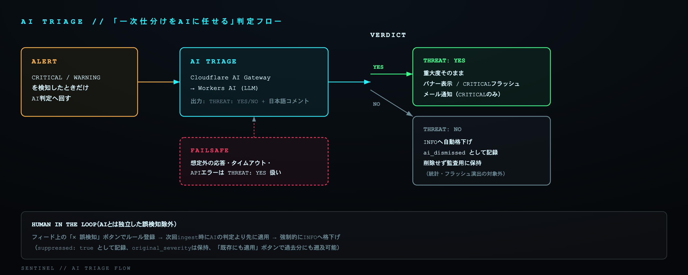

# AIトリアージ（Cloudflare AI Gateway）



CRITICAL/WARNINGアラート発生時、`app/notify.py`の`Notifier.alert()`が
`app/ai_triage.py`の`triage()`を呼び出し、生ログをWorkers AI（Cloudflare AI Gateway
経由）に渡して以下を行わせる:

1. **脅威判定**（`THREAT: YES` / `THREAT: NO`）
2. **日本語1〜2文のトリアージコメント**（何が起きたか・緊急度・次に確認すべきこと）

プロンプト（`ai_triage.py`の`SYSTEM_PROMPT`）は、応答を必ず
```
THREAT: YES または THREAT: NO
（続けてコメント本文）
```
の2行形式に固定させ、`_parse_response()`でパースする。**想定外の形式が返ってきた場合は
安全側（`is_threat=True`、つまり通知は消さない）に倒すフェイルセーフ**になっている。

`auto_dismiss_non_threats: true`（既定）の場合、`THREAT: NO`と判定されたアラートは
`Notifier.alert()`内で重大度が`info`に格下げされ、`ai_dismissed: true` /
`original_severity: <元の重大度>` が記録に付与される。格下げされたものは:
- WebUIの統計（CRITICAL/WARNING件数）には計上されない
- CRITICALフラッシュ演出・Webhook通知の対象外になる
- **削除はされず**、フィード内には半透明+「AI SILENCED」バッジ付きで表示され続ける
  （後から見返して監査できる）
- **TOPの「AI LATEST VERDICT」バナーには出さない**（目立たせる必要がないため）
- **例外（AIが非脅威と判定しても格下げしない）**: `web_watch`（ログ内のURLは攻撃者が制御できる
  文字列のため）と、侵入成功の相関検知（`allow_ai_dismiss=False`）。AIコメントは付くが重大度は
  そのまま残る

## ユーザー起点の抑制ルール（AIとは独立した誤検知除外）

AIの判定に頼らず、**人間が「これは脅威ではない」と一度教えたものは確実に黙らせたい**
というケース（開発用コマンド、既知の運用ファイルなど）向けに、AIトリアージとは別の
抑制ルール機能をWebUI側に持たせている。

- フィード上のCRITICAL/WARNINGアラートにマウスオーバーすると「✕ 誤検知」ボタンが出る
- クリックすると、カテゴリ＋メッセージに含まれる文字列（部分一致）＋対象ホスト
  （そのホストのみ／全ホスト共通を選択）でルールを登録できる
- 登録後は`/api/ingest/alert`の受信時点で**AIの判定より先に**このルールを適用し、
  一致したアラートは強制的にINFOへ格下げする（`suppressed: true`、`original_severity`は
  保持するので監査ログからは追える）
- サイドパネルの「SUPPRESSION RULES」で登録済みルールの一覧・削除ができる
- **ルール登録は将来のingestにしか効かない**（`/api/ingest/alert`受信時にその場で
  評価するだけなので、登録前に既にjsonlへ書き込み済みの過去アラートは対象外）。
  過去分にも遡って適用したい場合は「既存にも適用」ボタン
  （`POST /api/suppressions/reapply`）で、現在登録中の全ルールを`alerts.jsonl`の
  既存レコードに再評価・書き戻しできる
- 実装は`webui/main.py`の`_apply_suppressions()`。**WebUI側だけで完結する**ため、
  エージェント側の再デプロイは不要（AIトリアージ自体は引き続きagent側で実行されるので
  Cloudflareへの呼び出し自体は減らない点に注意。呼び出し自体を減らしたい場合は
  `config.yaml`の`known_process_keywords`等の恒久的なホワイトリストで対応する）

## AIトリアージのセットアップ手順

既定は無効（`ai_triage.enabled: false`）。account_id/gateway_id/api_tokenの
いずれかが未設定の場合も自動的にスキップされ、AIなしの従来どおりの通知になる
（`app/ai_triage.py`の`should_triage()`参照）。使いたい場合のみ以下を設定する。

1. Cloudflareダッシュボード → AI → **AI Gateway** で新規Gatewayを作成
   （認証はOFFにしてある。理由は[既知の制約](known-issues-and-lessons.md)参照）
2. **My Profile → API Tokens** で「Workers AI」テンプレートのトークンを発行
   （`Account.Workers AI:Read` + `Edit`）
3. 各ホストの`.env`に以下を設定:
   ```
   CF_AI_GATEWAY_TOKEN=<発行したトークン>
   ```
4. `app/config.yaml`の`ai_triage`セクションで`enabled: true`、
   `cloudflare_account_id` / `cloudflare_gateway_id`を設定
5. `docker compose up -d --build`（またはネイティブインストーラで再起動）

## 設計上の注意点

- **モデル**: 既定で軽量・高速な`@cf/meta/llama-3.1-8b-instruct-fast`を使用。
  精度を上げたい場合は`ai_triage.model`を別のWorkers AIモデルに変更する。
- **トリアージ対象の絞り込み**: `ai_triage.trigger_severities`（既定: critical, warning）
  でINFO等の高頻度アラートは呼ばない（コスト・レイテンシ抑制）。procnet_watchの
  初回スキャン等は大量の"未知プロセス"警告を出すため、これを絞らないとAI Gateway
  へのリクエストが大量発生する点に注意。
- **失敗時の挙動**: タイムアウト（既定8秒）・APIエラー時は`triage()`が`None`を返し、
  `Notifier.alert()`は通知自体を止めない（`ai_summary`が`None`のまま記録される）。
- **User-Agent偽装が必須**: CloudflareエッジがPython標準ライブラリ`urllib`の既定
  User-Agentをボットとして`HTTP 403 (error code: 1010)`でブロックするため、
  `ai_triage.py`内でブラウザ風のUser-Agentヘッダーを明示的に付けている
  （これを消すと突然AIトリアージが全滅するので注意）。
